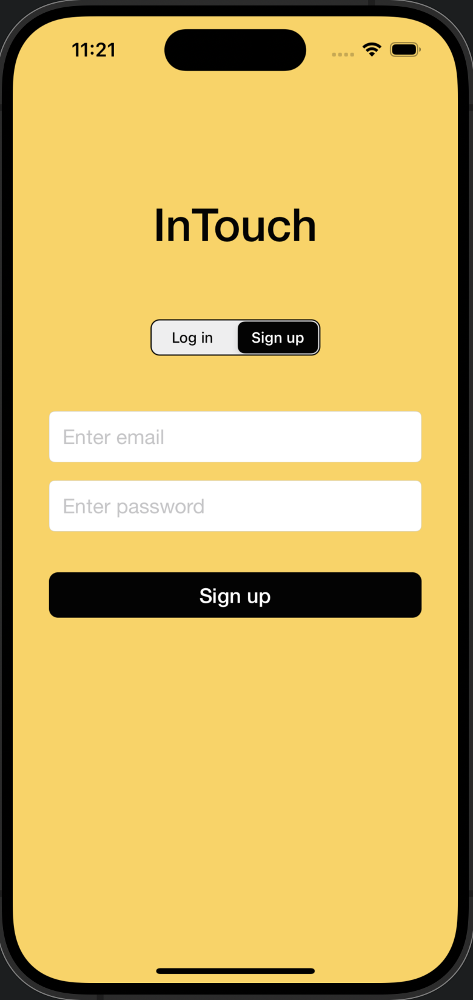
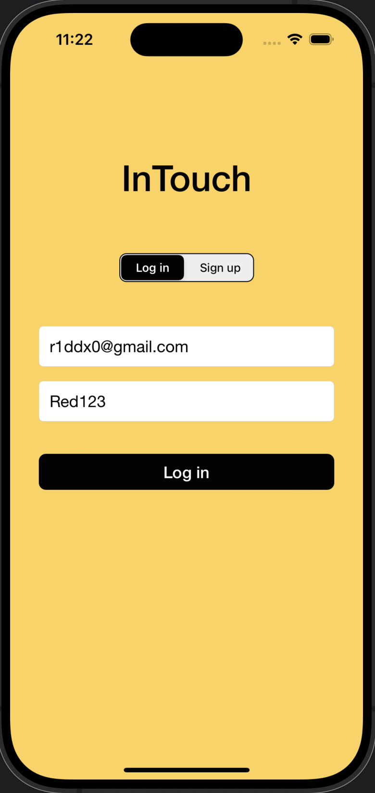
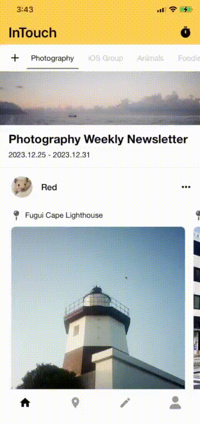

<div align="center">

<p align="center">
  
</p>

# InTouch
  

The only social media app you need to keep in touch with friends and family.
</div>

<br />

<div align="center">

**[Introduction](https://github.com/r1ddx2/InTouch/tree/develop?tab=readme-ov-file#-introduction) • 
[Requirements](https://github.com/r1ddx2/InTouch/tree/develop?tab=readme-ov-file#%EF%B8%8F-requirements) • 
[Getting Started](https://github.com/r1ddx2/InTouch/tree/develop?tab=readme-ov-file#%EF%B8%8F-getting-started) • 
[How Does InTouch Work?](https://github.com/r1ddx2/InTouch/tree/develop?tab=readme-ov-file#how-does-intouch-work) • 
[Tech Implementation](https://github.com/r1ddx2/InTouch/tree/develop?tab=readme-ov-file#-tech-implementation) • 
[Tech Stack](https://github.com/r1ddx2/InTouch/tree/develop?tab=readme-ov-file#-tech-stack) • 
[Author](https://github.com/r1ddx2/InTouch/tree/develop?tab=readme-ov-file#-author) • 
[License](https://github.com/r1ddx2/InTouch/tree/develop?tab=readme-ov-file#-license)**

</div>

<br />

## 📖 Introduction
InTouch is a social media app that prioritizes meaningful connections by curating a weekly feed update, offering users a deliberate way to share multimedia content with close friends or communities they join.

## ⚙️ Requirements
- iOS 16.0+

## ⚡️ Getting Started

### 1. Installation
Install by cloning the repo.
```
git clone https://github.com/r1ddx2/InTouch.git
```
### 2. Set up third-party libraries
To use InTocuh properly, navigate to the project folder and input the below in your command line.
```
pod install
```
### 3. Build & Run
Build and run the project in Xcode.
### 4. Log In or Sign Up
Start using InTouch by registering your own account or logging in with the default account that already has joined communities and contents to view!
- Register your own account
- Log in with default account

👤 Default account :
```
Account : r1ddx09@gmail.com
Password : Red123
```

<table>
  <tr align="center">
    <td>Sign up</td>
     <td>Log in</td>
  </tr>
  <tr>
    <td></td>
    <td></td>
  </tr>
 </table>

## ❓How Does InTouch Work?
- [Create or Join Groups](#➕-create-or-join-groups)
- [Post and Share Contents](#❤️‍🔥-post-and-share-contents)
- [Weekly Updated Feeds](#❗️-weekly-updated-feeds)
- [Explore Locations on the Map](#🧭-explore-locations-on-the-map)
- [Review Archived Newsletters](#🗂️-review-archived-newsletters)


### ➕ Create or Join Groups 
- Create groups and start a community!
- Join groups with the group code and start sharing contents with other members!
- Invite your friends to join your group!
<table>
  <tr align="center">
    <td>Create a group</td>
    <td>Join a group</td>
    <td>Invite friends</td>
  </tr>
  <tr>
    <td></td>
    <td></td>
    <td></td>
  </tr>
 </table>
 
### ❤️‍🔥 Post and Share Contents
- Upload photos along with location tagging and captions.
- Write short paragraphs to share your thoughts with the community.
- Generate audio messages to share long stories.
- Edit your submits anytime before the end of the week!

<table>
  <tr align="center">
    <td>Upload images</td>
     <td>Post short paragraphs</td>
     <td>Share audio messages</td>
     <td>Edit your submits</td>
  </tr>
  <tr>
    <td></td>
    <td></td>
    <td></td>
    <td></td>
  </tr>
 </table>
 
### ❗️Weekly Updated Feeds
- Feeds are only updated every Monday, enabling users to stay connected with friends in a time-conscious manner amid their busy lives.
- Be excited and check out the countdown for the next update!

<table>
  <tr align="center">
    <td>Scroll through feeds</td>
     <td>Countdown till next update</td>
  </tr>
  <tr>
    <td></td>
    <td></td>
  </tr>
 </table>
 
### 🧭 Explore Locations on the Map
- Track the footsteps of your friends and stay in sync with their journey.
- Find your current location.

<table>
  <tr align="center">
    <td>Discover places your friends been to</td>
     <td>Current Location</td>
  </tr>
  <tr>
    <td></td>
    <td></td>
  </tr>
 </table>
 
### 🗂️ Review Archived Newsletters
- Treasure the enduring memories cultivated within each community!

<table>
  <tr align="center">
    <td>Profile Page & Groups Profile Page</td>
  </tr>
  <tr>
    <td></td>
  </tr>
 </table>

## 📲 Tech Implementation
- Implemented the **MVC** architecture to ensure clarity and maintainability throughout the development process. 
- Enabled users to visually explore the geographic context of their posts with interactive pins, through **MapKit** and **Core Location**.  
- Allow a seamless search for places and locations through **Google API** and **Google SDK**, to accurately attach locations to user’s post contents.
- Provide users with the ability to play and record posted audio content through the utilization of **AVFoundation**. 
- Store user data and community updates by utilizing **Firebase Firestore** to efficiently store, retrieve, and synchronize data.  
- Integrating **Firebase Storage** to upload and manage different media files.
- Managed the user’s login and sign-up flow efficiently with the proficient use of **Firebase Authentication**. 
- Employed **Firebase Crashlytics** to monitor the app stability and capture real-time crashes.  
- Enforced coding standards and elevated quality assurance with **SwiftLint** to ensure consistent code.

## 📐 Tech Stack
- [UIKit](https://developer.apple.com/documentation/uikit/) - Construct and manage a graphical, event-driven user interface for your iOS, iPadOS, or tvOS app.
- [MapKit](https://developer.apple.com/documentation/mapkit) - Display map or satellite imagery within your app, call out points of interest, and determine placemark information for map coordinates.
- [Core Location](https://developer.apple.com/documentation/corelocation/) - Obtain the geographic location and orientation of a device.
- [AVFoundation](https://developer.apple.com/documentation/avfoundation/) - Work with audiovisual assets, control device cameras, process audio, and configure system audio interactions.
- [Firebase Firestore](https://firebase.google.com/docs/firestore) - Flexible, scalable NoSQL cloud database, built on Google Cloud infrastructure, to store and sync data for client- and server-side development.
- [SwiftLint](https://github.com/realm/SwiftLint) - A tool to enforce Swift style and conventions.

## 👨🏻‍💻 Author
 **Red Wang**
* Email: [red0wang9@gmail.com]()
* Linkedin: [Red Wang](https://www.linkedin.com/in/red-wang-19a49623a/)
* GitHub: [@r1ddx](https://github.com/r1ddx2)

## 📝 License

Copyright © 2023 [Red Wang](https://github.com/r1ddx2).<br />
This project is [MIT](https://github.com/r1ddx2/InTouch/blob/main/LICENSE) licensed.

